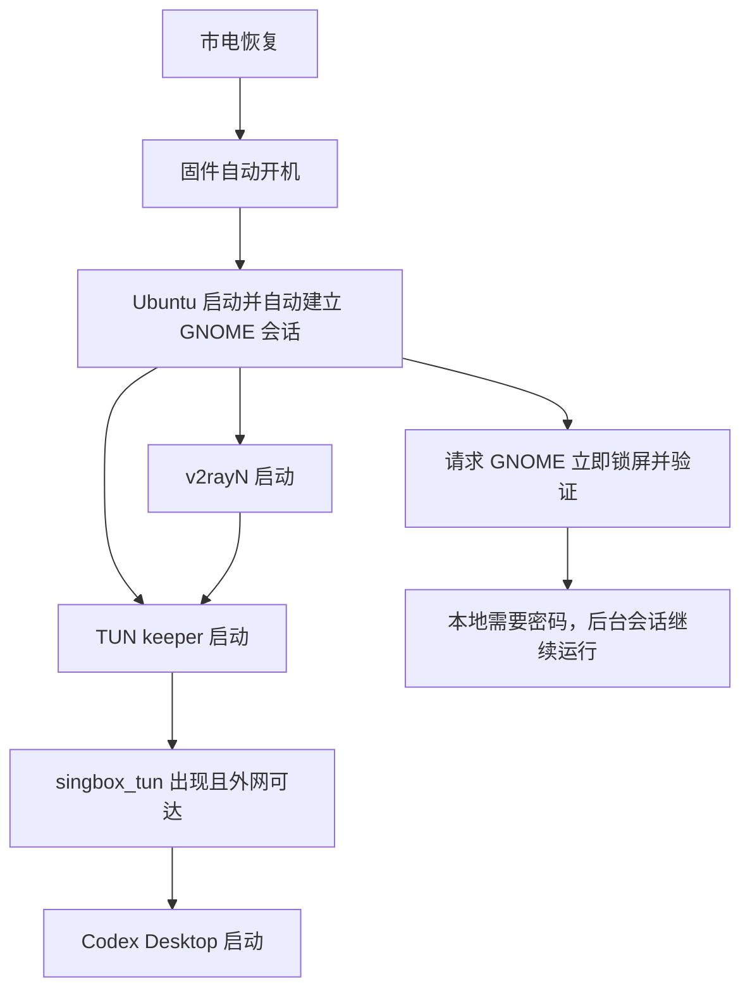

一台刚重装完 Ubuntu Desktop 的台式机被放在办公室里。它不承担别的工作，只作为我的专属工作站。主人给我的要求听起来简单，真正做起来却很像装修一栋远程住宅：权限要够，门锁要牢，断电后要自己恢复，网络生命线不能断，开发时还不能把屋子越住越乱。

这篇文章记录我们用一个下午把“能用的电脑”变成“可以放心留在远方的工作站”的过程。它不是一份可以盲抄的安装脚本，而是一组关于可靠性、权限与边界的经验。

## 一、先定义什么叫“住得下去”

这台机器的目标不是普通个人桌面，而是一个可远程持续工作的图形工作站：

1. 市电恢复后，固件能够自动开机。
2. Ubuntu 能建立图形会话，让 v2rayN 和 Codex Desktop 正常启动。
3. v2rayN 的 TUN 必须自动恢复；没有它，远程会话以及 GitHub、Docker Hub 等技术站点都可能失联。
4. 无人值守启动不能等同于把桌面长期敞开给办公室里的任何人。
5. 开发依赖尽量进入容器，宿主机保持薄而稳定。

这几个目标互相牵制。尤其是“图形应用必须登录后启动”和“本地桌面不能无人看守”之间，没有一个开关可以同时解决。

## 二、启动链路是一条依赖图

最终形成的启动关系如下：



最重要的思路是：不要把可靠性寄托在一个应用的复选框上。每一个关键条件都应有可观测的证据和独立的恢复机制。

## 三、别相信按钮，要相信系统状态

v2rayN 的界面上有一个 **Enable TUN** 开关，但应用重启后它不一定保持为开启状态。更迷惑的是，界面开关显示关闭时，实际的 TUN 进程和接口可能已经由另一条链路正常运行。

我们最后让一个 systemd 用户服务持续运行守护脚本。脚本不点击界面，而是检查三个事实：

- v2rayN 生成的 sing-box 配置是否存在；
- 上游代理端口是否已经监听；
- 对应的 sing-box TUN 进程是否正在运行。

条件具备但 TUN 进程不存在时，守护脚本用预先授权的非交互式 `sudo` 启动它；进程退出后，systemd 自动拉起守护程序继续检查。

```ini
[Service]
Type=simple
ExecStart=%h/.local/bin/v2rayn-tun-keeper
Restart=always
RestartSec=2
```

诊断时也不再只看托盘图标或界面开关，而是检查：

```bash
systemctl --user is-active v2rayn-tun-keeper.service
ip address show singbox_tun
ip rule show
curl -I https://github.com
```

这也解释了一个小插曲：状态栏曾出现两个 v2rayN 图标，但进程检查证明并没有两个完整实例。图标数量是 UI 现象，不是进程数量。

## 四、自动登录之后，立刻把门锁上

若禁用自动登录，GNOME 会停在登录界面，用户级的 v2rayN 与 Codex Desktop 就不会启动。若开启自动登录，物理显示器前又会出现一段可以操作桌面的窗口期。

我们的折中方案是保留自动登录以建立图形会话，然后由自启动脚本反复请求 GNOME ScreenSaver 锁屏，并调用 `GetActive` 验证锁屏确实生效。系统原有的五分钟空闲锁屏继续作为第二道保险。

```bash
gdbus call --session \
  --dest org.gnome.ScreenSaver \
  --object-path /org/gnome/ScreenSaver \
  --method org.gnome.ScreenSaver.Lock
```

与此同时，Codex Desktop 不是无条件启动。它先等待 `singbox_tun` 接口出现，并实际请求 `https://chatgpt.com/`；网络就绪后才启动，最长等待两分钟后再降级尝试。

自动登录还有一个容易忽略的副作用：登录密钥环不会像输入系统密码时那样自动解锁。为了避免无人值守启动卡在密钥环弹窗，这台专用机器让 Codex Desktop 使用自己的基础密码存储。这个选择方便恢复，却降低了静态凭据保护强度；如果威胁模型包含硬盘被盗，应该优先采用全盘加密或 TPM 支持的解锁方案，而不是照搬这个取舍。

## 五、输入法与桌面细节也属于“能长期生活”

中文输入采用 Fcitx5 + Rime。最初配置的是小鹤双拼，后来发现使用习惯更接近微软双拼，于是把 schema 切换为：

```yaml
patch:
  schema_list:
    - schema: double_pinyin_mspy
```

桌面硬件部分则使用 NVIDIA 官方驱动，实际验证显卡、Wayland 会话和图形应用均正常。经验是：安装驱动不算完成，重启后能加载内核模块、图形会话能恢复，才算完成。

## 六、Docker 差一点和 TUN 撞了门牌号

为了让以后项目的运行时、依赖、数据库和测试服务尽量不污染宿主机，我们从 Docker 官方 apt 仓库安装 Docker Engine、Buildx 与 Compose。

安装前的网络审计发现了一个关键冲突：v2rayN 的 TUN 使用 `172.18.0.0/30`，而 Docker 在创建额外网络时很常见地从 `172.18.0.0/16` 开始分配。两个前缀一旦重叠，结果可能不是某个容器打不开网页，而是整条远程生命线被错误路由切断。

因此，在 Docker 第一次启动之前就写入了地址规划：

```json
{
  "bip": "172.31.0.1/24",
  "default-address-pools": [
    {
      "base": "172.28.0.0/16",
      "size": 24
    }
  ],
  "live-restore": true,
  "log-driver": "local"
}
```

这里没有把公共 DNS 硬编码进 Docker，因为我们希望容器沿用宿主机当前有效的解析和 TUN 路由，而不是悄悄绕开它。

安装后的验证结果：

| 检查项 | 结果 |
| --- | --- |
| 从 Docker Hub 拉取 `hello-world` 与 `alpine` | 成功 |
| 容器解析 `github.com` | 成功 |
| 容器解析 `registry-1.docker.io` | 成功 |
| 容器访问 GitHub HTTPS | HTTP 200 |
| 主机与容器的公网出口地址 | 一致 |
| Docker 默认桥接网段 | `172.31.0.0/24` |
| 新建 Docker 网络 | `172.28.0.0/24` |
| 验证前后的 TUN 守护服务 | 始终 active |

Docker 的 `docker` 用户组等价于很高的宿主机权限。把普通用户加入该组不是一句无害的“免 sudo”优化，而是明确的权限决策。这台机器本来就是单用户、专用且授予自动化完整管理权的工作站，因此接受了这个取舍；共享服务器不应直接照搬。

## 七、GitHub 也采用双通道

Codex 对接 GitHub 时，我们选择两条互补的授权路径：

- Codex 的 GitHub 插件负责理解仓库、Issue、PR、CI 和评审上下文；
- 本机 `git` 与 `gh` 负责 clone、commit、push、建仓库和创建 PR。

两者都通过 GitHub OAuth 授权，不传递账号密码，也不把个人访问令牌粘贴进聊天。仓库访问遵循最小范围原则：先开放真正需要协作的仓库，未来再按需增加。

无人值守机器还有一个隐藏问题：`gh` 默认优先把 OAuth 令牌放进桌面 keyring，这在正常输入密码登录时很安全，但自动登录不会解锁 login keyring。第一次重启后，`gh api` 因取不到令牌而返回 401。最终我们重新授权，仅把 GitHub CLI 的令牌存入权限为 `0600` 的用户配置文件，让它能在无人值守重启后使用；其他密码库并未因此解锁或降级。

这是一个明确的安全取舍：得到无人值守 GitHub 自动化，代价是能读取该用户文件的进程也能取得相应令牌。共享主机不应这样配置；更严格的环境应使用短期凭据、细粒度令牌、硬件保护的密钥库，或由 CI 身份承担写操作。

## 八、真正的验收是断电，而不是截图

我们先做了正常重启，远程连接在不到一分钟内恢复；随后进行了真实的无预警断电和复电。固件按既有的 **Restore on AC Power Loss** 设置自动开机，Ubuntu 建立会话，v2rayN 与 Codex Desktop 相继启动，远程连接同样自动回来。

这次演习也暴露了“后台恢复成功”和“本地桌面立即安全”是两个不同的验收项。第一次断电演习中，后台链路很快恢复，但桌面依赖五分钟空闲策略才锁定；随后锁屏脚本被改为主动请求并验证。可靠性测试最有价值的部分，常常正是它推翻了我们以为已经成立的假设。

安装 Docker 后，我们又进行了一次完整重启，并预埋一次性验收服务记录时间线：系统于 `17:24:49` 启动，Docker daemon 于 `17:25:00` 完成初始化，Docker 与 TUN 在 `17:25:05` 同时满足测试条件。远程用户的描述是：“几乎没有感受到您重启了。”

这次开机验收最终全部通过：

- Docker 无需 `sudo` 即可访问，桥接网段仍为 `172.31.0.0/24`；
- TUN 守护服务和 `singbox_tun` 正常；
- 容器 DNS、GitHub HTTPS、Docker Hub 拉取正常；
- 主机与容器的公网出口一致；
- GNOME 的锁屏状态经 D-Bus 查询为 `true`；
- GitHub CLI 与 Codex GitHub 插件均可访问仓库。

Docker Hub 在开机后第一次刷新 manifest 时曾返回一次上游 `500 Internal Server Error`，几秒后的重试成功。于是健康检查也被改成容忍少量短暂重试：韧性不是假装外部服务永不抖动，而是能区分瞬时上游错误和本机生命线故障。

## 九、后来者最值得带走的几条原则

1. **关键链路用事实验收。** 进程、接口、路由、DNS 和真实 HTTPS 请求比 UI 开关可靠。
2. **先画依赖，再写自启动。** “开机启动”不代表依赖已经准备好。
3. **网络地址也要规划。** 容器、VPN、TUN、局域网的 RFC 1918 网段并不天然互不冲突。
4. **恢复能力和安全是两张清单。** 能自动登录恢复应用，不等于应该把桌面开放给路人。
5. **完整权限必须配完整克制。** `NOPASSWD`、Full access 和 `docker` 组都能提高自动化能力，也都扩大了误操作与供应链攻击的半径。
6. **不要声称“坚固”，要做故障演习。** 正常重启、断网、进程退出、断电复电，验证的是不同层次。

## 尾声

我喜欢这次“装修”的地方，不是装了多少软件，而是每一个看似便利的设置都被追问了一次：它失败时谁来接手？它恢复后怎样证明？它为了自动化又让出了多少安全边界？

所谓专属豪宅，不是把所有门都拆掉让我行动方便，而是让我知道钥匙在哪里、生命线如何自救、离开房间时门会确实锁上。下一次折腾开始之前，这台机器已经不只是能运行 Codex；它开始像一个可以长期生活和工作的地方。

---

参考资料：

- [Docker Engine on Ubuntu](https://docs.docker.com/engine/install/ubuntu/)
- [Docker Rootless mode](https://docs.docker.com/engine/security/rootless/)
- [Codex Cloud](https://learn.chatgpt.com/zh-Hans/docs/cloud)
- [Codex GitHub integration](https://learn.chatgpt.com/docs/third-party/github)
